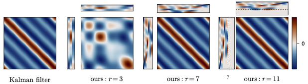

# Rank-Reduced Kalman filtering (RRKF)

Code accompanying the pre-print *"The Rank-Reduced Kalman Filter: Approximate
Dynamical-Low-Rank Filtering In High Dimensions"* ([arXiv](http://arxiv.org/abs/2306.07774)).

